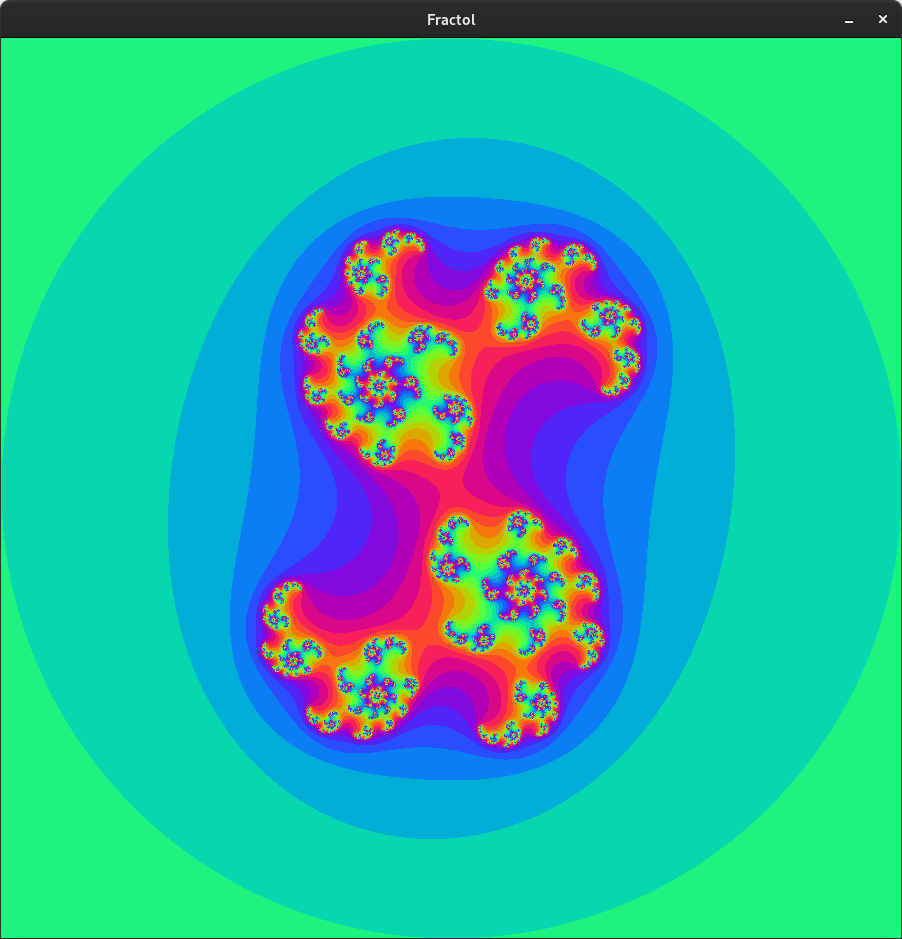
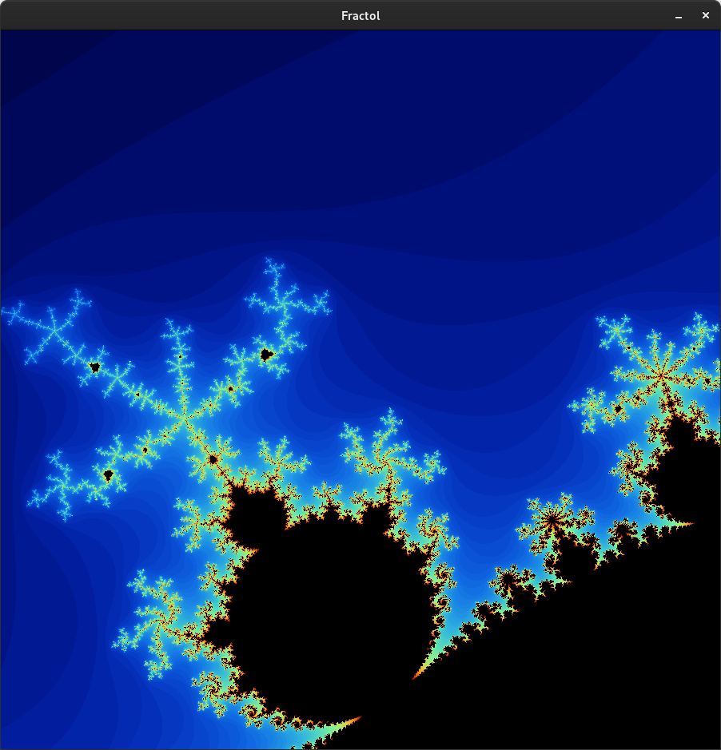
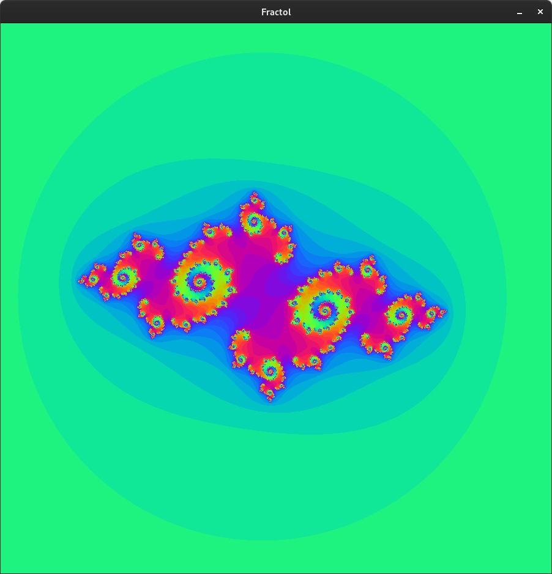
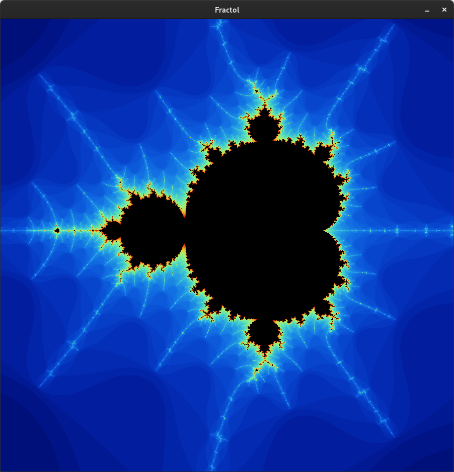
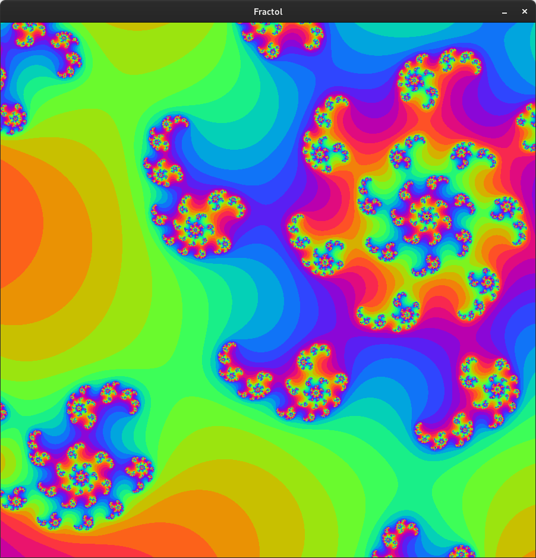
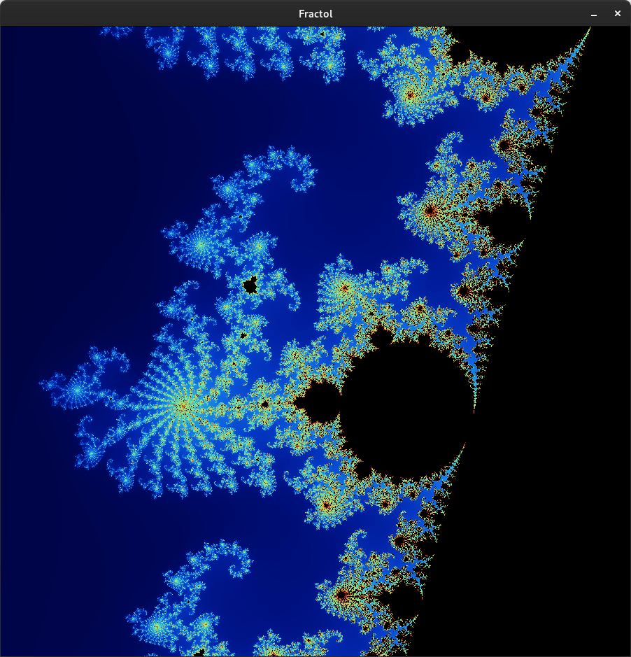

# fract-ol
```
FINAL GRADE: 120/100
```
- 2D programming
- Mathematics

**Project goal:** To create a fractal visualization program using the MiniLibX library, allowing interactive exploration of the Mandelbrot and Julia sets.

### Mandatory
In the fract-ol project, you create a program that displays fractals using the MiniLibX library. The goal is to create a graphical interface that allows you to visualize different fractals, such as the Mandelbrot and Julia sets, with interactive features like zooming and panning.

- Your program should display the fractals in a MiniLibX window.
- When launching, you should be able to specify which type of fractal to display.
- You can use the mouse wheel to zoom in and out of the fractal.
- The program must handle keyboard events (e.g., pressing ESC to exit the program).
- You must support creating different Julia sets by passing various parameters.
- Color schemes should be used to visualize the depth of the fractals, creating interesting visual effects.

### Bonus
- ❌ **Additional Fractal**: Implement another fractal type in addition to the Mandelbrot and Julia sets.
- ✅ **Mouse-Positioned Zoom**: Make the zoom functionality follow the position of the mouse instead of centering on the middle of the window.
- ✅ **View Panning**: Add the ability to pan the view using arrow keys, allowing users to explore different parts of the fractal.
- ✅ **Color Palette Shifting**: Implement a shifting color palette to add dynamic effects to the fractal visualization.

### Additional Features
- ✅ Increase iterations with the `+` key and decrease with the `-` key.
- ✅ Julia set recalculates based on mouse left click coordinates.

<div style="display: flex; flex-wrap: wrap; justify-content: space-between;">
  
  
  
  
  
  
</div>
Subject version: 3.
